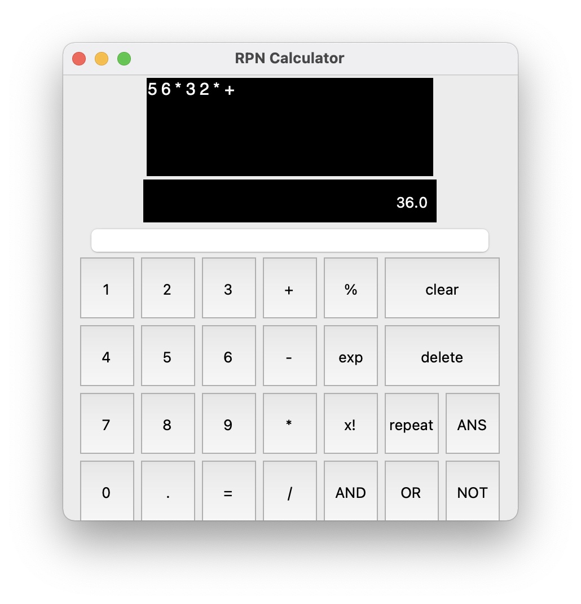

# RPN Calculator with GUI

A desktop reverse polish notation calculator that supports integer and decimal operants in operations including:
- basic arithmetics (+, -, *, /)
- percent (%)
- exponent (^)
- integer division (//)
- factorial (!)
- bitwise operations (& | ~)
- reuse (:ans)
- repeat (!)



## General Format 
```A B +```
* Delimited by a single space
* No space after last character
* Clear before each new calculation.

## Examples

### Basic Arithmetics
A plus B  
```A B +```

### Percent
A plus B percent of A  
```A B % +```

### Exponent
A to the power of B  
```A B ^```

### Integer Division
A divided by B, rounded down to the highest integer  
```A B //```

### Factorial
A factorial  
```A !```

### Bitwise Operations
NOT A  
```A ~```

### Reuse
A plus (last answer)  
```A :ans +```

### Repeat
A plus B plus C plus D  
```A B C D + !```

